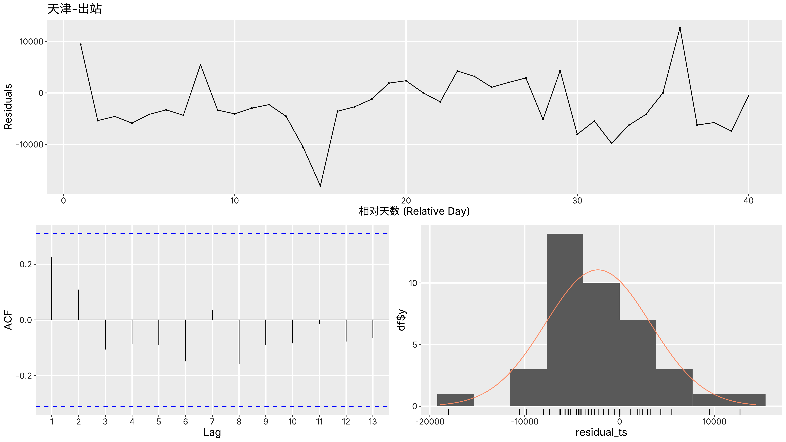
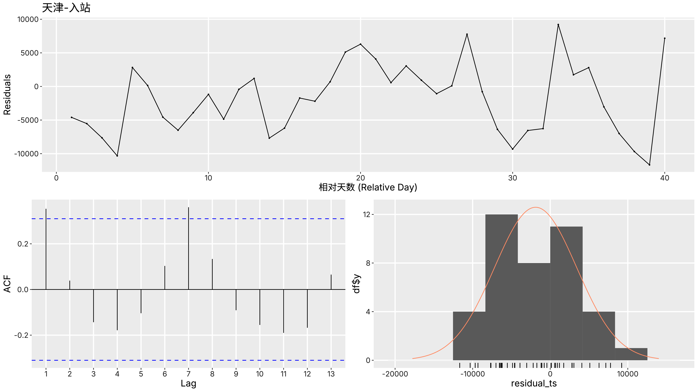
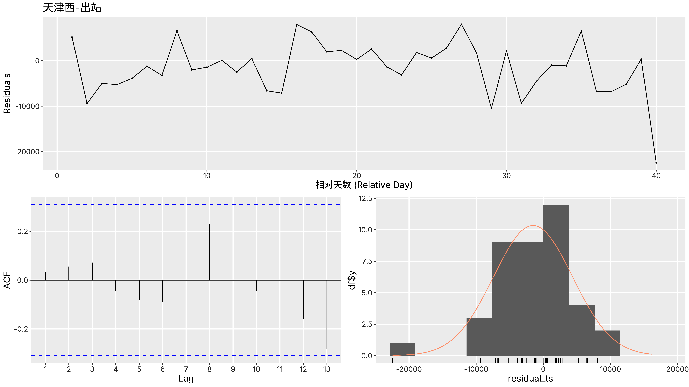
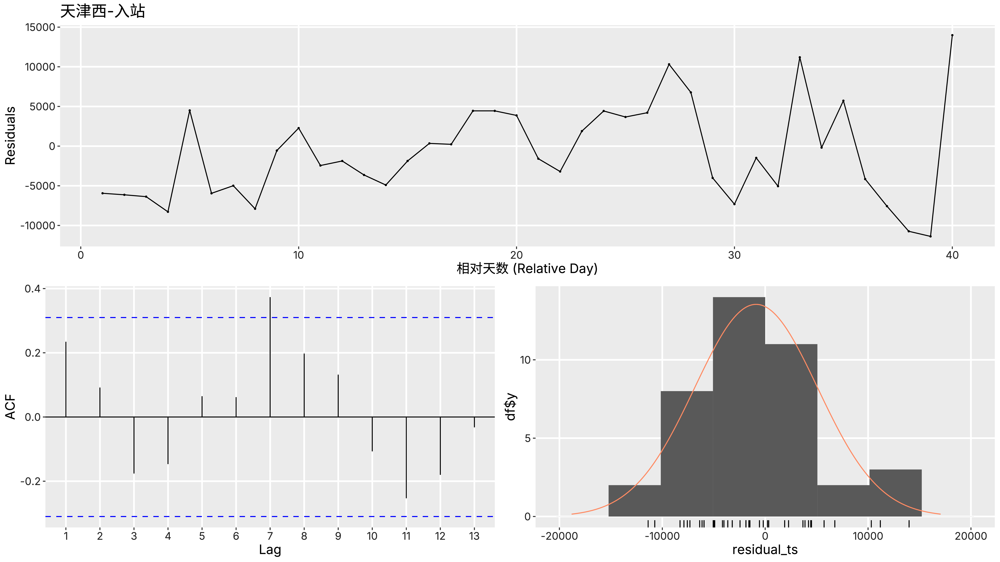
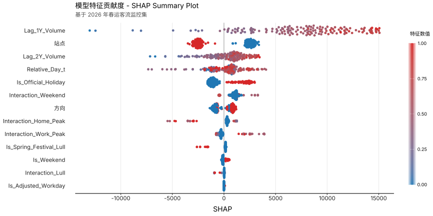

::: {custom-style="Subtitle"}
（1. 河北工业大学建筑与艺术设计学院，天津 300130）
:::

::: {custom-style="Abstract"}
[摘要：]{custom-style="Abstract Title2"} 为解决春运期间复杂的人流量预测问题，充分学习春运期间日期特征与人流量之间的复杂非线性关系，得出具有可信度的预测结果，使用机器学习与监督学习方法是达成目的的有效方法。为应对春运期间客流量特有的周期性特征，本论文采用了以scikit-learn+XGBoost为技术栈的回归预测模型训练方式，通过将站点、出/入站、年份的固有特征与农历相对日期、周末、节假日、返乡潮、返工潮的由公历日期推测出的时序特征结合，以逐年扩增的时间窗口，自2023年逐年向前预测作为训练策略，训练出一个在绝对误差量化矩阵、残差白噪声检验、SHAP（SHapley Additive exPlanations）值指标上都具有良好表现的带分类特征的全局单目标模型，使用该模型能够较为可信地预测出未来两年春运时期内各站点的入/出客流量。

自完成完整的机器学习预测模型训练，从实例中总结经验后，能够深刻体会到数据挖掘与现代的机器学习技术在工业设计领域的宝贵价值，该技术在工业设计领域中的介入为整体的设计流程在意向调查、风格确定、人机优化等方面提供了坚实的数据驱动的基础。

训练详细代码部分在[https://github.com/PeHa393/train-train]处可以进一步观看。

[关键词：]{custom-style="Abstract Title2"} 机器学习；数据挖掘；监督学习；工业设计；
:::

::: {custom-style="English Title"}
Case Study and Reflections on Predicting Passenger Flow During the Spring Festival Travel Rush Using Machine Learning
:::

::: {custom-style="English Author"}
Zhang Hanwei^1^
:::

::: {custom-style="English Subtitle"}
(1. School of Architecture and Art Design, Hebei University of Technology, Tianjin 300130, China)
:::

::: {custom-style="English Abstract"}
[Abstract:]{custom-style="English Abstract Title2"} To address the challenge of predicting complex passenger flow during the Spring Festival travel rush, fully capture the complex nonlinear relationship between date-specific features and passenger flow during this period, and generate reliable forecast results, the use of machine learning and supervised learning methods is an effective approach. To address the unique periodic characteristics of passenger flow during the Spring Festival travel season, this paper employs a regression prediction model training approach based on the scikit-learn + XGBoost technology stack. By combining the intrinsic features of stations, departure/arrival points, and years with temporal features derived from Gregorian calendar dates—such as relative Lunar calendar dates, weekends, public holidays, and the peak periods for returning home and returning to work—and using a time window that expands year by year, and a training strategy that forecasts forward year by year starting from 2023. This approach resulted in a global single-objective model with classification capabilities that demonstrates excellent performance across metrics such as the absolute error matrix, residual white noise test, and SHAP (SHapley Additive Explanations) values. This model can reliably predict passenger arrival and departure volumes at various stations during the Spring Festival travel season over the next two years.

Having completed the training of a comprehensive machine learning prediction model and drawn lessons from this experience, we have gained a deep appreciation for the invaluable value of data mining and modern machine learning technologies in the field of industrial design. The integration of these technologies into industrial design provides a solid data-driven foundation for the overall design process, particularly in areas such as concept exploration, style definition, and human-machine interaction optimization.

The detailed training code can be viewed at [link].

[Keywords:]{custom-style="English Abstract Title2"} Machine learning; Data mining; Supervised learning; Industrial design;
:::



# 绪论 Introduction

本研究面对的春运站点客流量数据，展现出复杂的非标准特征：首先是公历与农历间历法的错位与时序不连续的问题，春运的核心驱动力源于农历，但现实数据以公历记录，导致年与年之间的同质日期在时间轴上产生错位；同时，春运仅占全年的40天，年际间的数据在时序上是断层的，无法构成连续的时间序列。其次是小样本与高维非线性特征共存的问题，本研究的时间窗口覆盖近四年，单站点的有效样本量仅为160个样本点，但在特征构建上除农历日期、站点、出入站分类之外，还包含了多种由日期推测出的时序特征（如节假日、返乡潮等等），这些特征对于客流量的影响是不可忽视的。这就导致整体数据呈现典型的高维非线性分布。这种特殊的“小样本、高维度、不连续”的数据结构，明确了对于训练方法的选择。

针对上述数据特性，采用基于机器学习的监督学习方法是完成本研究任务的最佳方式。一方面，客流量预测本质上是一个目标明确的连续回归问题，历史真实的日客流量提供了绝对可信的标签，这决定了采用目标导向的“监督学习”能够最直接地建立特征与客流之间的映射关系，而无监督或自监督学习在此类带标签的精确数值预测任务中缺乏适用性。另一方面，面对春运数据的“时序断层”与“小样本”局限，传统时间序列模型因严格的连续平稳性假设而完全失效，而以深度学习（如LSTM、Transformer）为代表的序列模型，不仅难以处理断续的时间步，更会在面对单站点仅百余天的训练样本时陷入严重的过拟合。因此，能够摆脱时序连续性依赖、将时间信息转化为静态表格特征进行挖掘的传统机器学习方法，成为了最优的方法论基石。

在众多机器学习监督算法中，极端梯度提升树（XGBoost）模型展现出了与春运数据特征最高的契合度。首先，针对高维与非线性特征，XGBoost基于信息增益的树状分裂机制，对多源异构的表格型数据具有天然的处理优势，无需复杂的特征映射即可精准捕捉“公历周末”与“农历除夕”等等特征引发的非线性客流突变。其次，针对“小样本”困境，XGBoost内置的L1/L2正则化项与行列子采样策略，从算法底层提供了强大的抗过拟合能力，确保了模型在小规模数据集上的泛化性。最重要的是，XGBoost支持将跨年份、跨站点的离散数据整体打包为“全局单目标模型”进行训练，彻底绕开了年际数据不连续的障碍。综上所述，XGBoost不仅在数学原理上克服了春运预测的数据瓶颈，更兼具出色的特征可解释性。

# 对于春运高铁站客流量的预测模型的训练与预测

## 数据清洗与格式化

对于原数据表格进行分析，发现原数据表格呈现出“按入站和出站分工作簿，按年份分表”的结构。整体分为8个表格，名为“发送”和“到达”的工作簿各有4个表头为“日期，天津，天津西”的子表格，其中“日期”列为8位无符号数字展示的公历日期，“天津”与“天津西”列为站点的客流量，每个子表均为一个3列40行的表格，一个标准的子表格式与内容如 @tbl-original 所示。

```{r}
#| echo: false
#| message: false
#| warning: false
#| label: tbl-original
#| tbl-cap: "原数据的子表样式"

library(flextable)
library(officer)
library(readr)
library(magrittr) # 引入管道符 %>%

# 读取数据
my_data <- read.table(text = "
日期, 天津西, 天津
20230107, 22194, 27572
20230108, 21978, 27770
20230109, 26018, 31596
……, ……, ……
", header = TRUE, sep = ",", strip.white = TRUE)
ft <- flextable(my_data)

# 分配列宽

# 获取总列数
n_cols <- ncol_keys(ft)

# 换算为物理英寸并应用
printable_width <- 5.75
final_widths <- printable_width / n_cols

# 定义字体规则（中英双语）
my_font <- fp_text(
  font.family = "Times New Roman", 
  eastasia.family = "SimSun",
  font.size = 9  # 小五号字
)

# 定义三线表线宽（单位：磅 pt）
# 顶线和底线 1.5pt，中线 0.75pt
line_thick <- fp_border(color = "black", width = 1.5) 
line_thin  <- fp_border(color = "black", width = 0.75)


# 将规则应用到 flextable
ft <- ft %>%
  # 清空默认样式
  border_remove() %>% 

  # 将表格布局定义为 "fixed"（固定布局）
  set_table_properties(layout = "fixed", width = 1.0) %>%

  # 写入定义的宽度
  width(width = final_widths) %>%
  
  # 字体与字号设定
  style(pr_t = my_font, part = "all") %>%

  # 加粗表头
  bold(part = "header") %>%
  
  # space = 1.5 代表 1.5 倍行距
  line_spacing(space = 1.2, part = "all") %>% 
  # padding 控制单元格文字距离边框的绝对距离（上下左右留白），避免文字贴线
  padding(padding.top = 2, padding.bottom = 2, part = "all") %>%
  
  # 绘制三线表
  # 1. 顶线：表头 (header) 的最上方
  hline_top(border = line_thick, part = "header") %>%
  # 2. 中线：表头 (header) 的最下方
  hline_bottom(border = line_thin, part = "header") %>%
  # 3. 底线：表体 (body) 的最下方
  hline_bottom(border = line_thick, part = "body") %>%
  
  # --- E. 布局对齐 ---
  align(align = "center", part = "all")

# 输出表格
ft
```

对于该表格的处理，主要目标是“宽表转长表”，即将不同的站点、方向与年份对应的子表合并成一张总表，其预期的表头应当为“公历日期、站点名称、方向（入站/出站）、客流量”；其次是为每一列赋予其合适的格式（如公历日期列下的值转换为标准的datetime格式）。在本文中选择了python语言和该语言内的polars包来处理表格的清洗与格式化。

针对原始数据子表的抓取，以包含“日期”关键字的列为基准进行自适应抓取，采用逆透视（Unpivot）操作将宽表转化为长表格式，将横向展开的“站点”转化为具体的特征向量。此外，为了使树模型能隐式捕获进出站客流之间的负相关潮汐规律，模型将原有的“入站量”与“出站量”解耦，统一合并为唯一的预测目标变量“Volume”，并将“方向（入站/出站）”降维为类别特征。在处理完毕后，原数据内的8张子表现在已经合成为4列640行的总表。

在类型格式化阶段，本研究对预测目标向量“Volume”进行了类型清洗与异常值修复。在类别特征的处理上，本研究通过显式的类别声明（Polars的pl.Categorical函数）将文本特征（如站点、方向）传入模型。这一约束使得 XGBoost 能够直接激活 enable_categorical=True 与 tree_method="hist" 机制，在算法层面寻找最优分类节点，显著降低内存开销的同时，大幅提升了模型的收敛效率。

## 数据特征提取

对于清洗后的表格，已经有了日期、站点、方向、客流量的基本特征，但正如上文所说，由公历日期与农历日期推出的特征不可忽视，故要对该表的特征进行进一步提取和构造。

其主要任务首先是为公历日期添加相应的农历日期特征，因春运客流量数据的特点，每年的数据在公历日期上不同，但在农历日期上是完全一致的，因此可以依靠农历日期，以“大年初一”为0点，为每年的40天日期建立相对日期（范围位于[-15,25]），在表格中新建一列，记作“Relative_Day_t”，为年之间离散的数据建立联系。

其次是要根据国务院每年发布的《国务院办公厅关于XXXX年部分节假日安排的通知》为每一天分配工作日、节假日、调休日，在表格中新建三列，记作“Is_Weekend”、“Is_Official_Holiday”和“Is_Adjusted_Workday”；并按照惯例为每年的日期区间赋予“返乡潮”、“返工潮”和“年中低谷”特征，在表格中新建两列，记作“Is_Return_Home_Peak”、“Is_Return_Work_Peak”和“Is_Spring_Festival_Lull”。这里的“返乡潮”设定为大年初一前一周的时间，“返工潮”设定为大年初五到元宵节的时间，“年中低谷”设定为大年初一到大年初三的时间；该特征完全与原数据无关，即不是从原数据趋势中提取的，以防止训练过程的目标泄露。

鉴于每年春运周期极短，传统基于连续日的滞后特征在多步预测中极易引发误差累积。为跨越时间断层，本研究构建了“跨年同日滞后特征”。即提取历史同期、同站点、同方向且同相对天数的客流量作为数值基准，为每一天的客流量数据附加“去年同日数据”和“前年同日数据”，在表格中新建两列，记作“Lag_1Y_Volume”和“Lag_2Y_Volume”。此外，对于早期年份生成的自然缺失值（NaN），本研究避免使用均值或零值填充，而是直接保留原貌，依托XGBoost的稀疏感知（Sparsity-aware）分割算法对缺失值进行原生处理，有效防止了人为填充对真实数据分布的破坏。

春运客流呈现出典型的“潮汐”特征。为有效捕捉这一复杂动态，本研究结合春节普遍行为与天津本身的区域核心与重要的产业承载地的城市特点，根据该特点推测出天津应当在“返乡潮”时出站量增加，“返工潮”时入站量增加的原则，将站点、方向与时间三个维度进行组合，构建了高阶的交互特征（表现为如同“天津站+出站+返乡潮”的条件形式），其构建的特征项目与构建依据如 @tbl-characters 所示。这些富含强物理业务逻辑的高阶交互特征，能够为模型提供高度浓缩的信息增益，使得浅层树能够迅速识别并拟合截然相反的潮汐方向，大幅提升收敛效率。在本部分特征提取后，得出的表格内共有“公历日期、站点、Relative_Day_t、Is_Weekend、Is_Official_Holiday、Is_Adjusted_Workday、Is_Return_Home_Peak、Is_Spring_Festival_Lull、Is_Return_Work_Peak、方向、Volume、Lag_1Y_Volume、Lag_2Y_Volume、Interaction_Home_Peak、Interaction_Work_Peak、Interaction_Lull、Interaction_Weekend”共17个特征，该表格将会作为训练数据直接进入机器学习的过程中。

```{r}
#| echo: false
#| message: false
#| warning: false
#| label: tbl-characters
#| tbl-cap: "高维特征项目与构建依据"

library(flextable)
library(officer)
library(readr)
library(magrittr) # 引入管道符 %>%

# 读取数据
my_data <- read.table(text = "
特征名, 特征结构, 依据
Interaction_Home_Peak, 站点+方向+返乡潮, 天津是一个“务工型城市”，故在返乡潮期间特定站点下的出站客流量会增多。
Interaction_Work_Peak, 站点+方向+返工潮, 如同上一列所说，“务工型城市”在“返工潮”期间会有较多的入站客流量。
Interaction_Lull, 站点+方向+年中低谷, 对于所有站点适用，春节的核心时段（大年初一到大年初三）中人员流动不会太多。
Interaction_Weekend, 站点+方向+周末, 对于所有站点适用，人们返乡会挑选周末作为出行时间。
", header = TRUE, sep = ",", strip.white = TRUE)
ft <- flextable(my_data)

# 分配列宽

# 获取总列数
n_cols <- ncol_keys(ft)

# 换算为物理英寸并应用
printable_width <- 5.75
final_widths <- printable_width / n_cols

# 定义字体规则（中英双语）
my_font <- fp_text(
  font.family = "Times New Roman", 
  eastasia.family = "SimSun",
  font.size = 9  # 小五号字
)

# 定义三线表线宽（单位：磅 pt）
# 顶线和底线 1.5pt，中线 0.75pt
line_thick <- fp_border(color = "black", width = 1.5) 
line_thin  <- fp_border(color = "black", width = 0.75)


# 将规则应用到 flextable
ft <- ft %>%
  # 清空默认样式
  border_remove() %>% 

  # 将表格布局定义为 "fixed"（固定布局）
  set_table_properties(layout = "fixed", width = 1.0) %>%

  # 写入定义的宽度
  width(width = final_widths) %>%
  
  # 字体与字号设定
  style(pr_t = my_font, part = "all") %>%

  # 加粗表头
  bold(part = "header") %>%
  
  # space = 1.5 代表 1.5 倍行距
  line_spacing(space = 1.2, part = "all") %>% 
  # padding 控制单元格文字距离边框的绝对距离（上下左右留白），避免文字贴线
  padding(padding.top = 2, padding.bottom = 2, part = "all") %>%
  
  # 绘制三线表
  # 1. 顶线：表头 (header) 的最上方
  hline_top(border = line_thick, part = "header") %>%
  # 2. 中线：表头 (header) 的最下方
  hline_bottom(border = line_thin, part = "header") %>%
  # 3. 底线：表体 (body) 的最下方
  hline_bottom(border = line_thick, part = "body") %>%
  
  # --- E. 布局对齐 ---
  align(align = "center", part = "all") %>%

  # 仅让第 3 列 (j = 3) 的正文数据 (part = "body") 左对齐
  align(j = 3, align = "left", part = "body")

# 输出表格
ft
```

## 预测模型训练

春运客流数据具有样本量受限、时序高度非连续（跨年断层）以及包含宏观环境带来的异常波动（如2023年非平稳期）等复杂特性。针对此类“小样本-强干扰”场景，本研究提出并实施了基于XGBoost的全局单目标模型训练策略，其核心训练机制如下：

鉴于春运数据呈块状分布，传统的随机折叠（K-Fold）会破坏时序的自回归依赖。本研究设计了逐年外推的“时序扩增窗口”验证机制。具体构建三个递进的验证折叠区（第一折叠为23年数据推算24年数据，第二折叠为23+24年数据推算25年数据，第三折叠为23+24+25年数据推算26年数据），通过计算三次时间外推预测在验证集上的误差期望值（如MAPE/RMSE），真实量化模型应对未见数据的时序泛化能力。

为抑制模型对特定年份微观噪点的过拟合，本研究将最大树深（max_depth）限制在浅层区间（3~5层），并加大L1与L2正则化的惩罚项权重。在基于网格搜索确定初步超参数后，引入排列重要性检验。通过观测打乱单一特征列后的验证误差变化，精准识别并剥离引发多重共线性及负增益的全局冗余特征，实现特征空间的极简净化。

在网络结构与特征子集敲定后，本研究划分前三年（2023-2025）为训练集，独立留出最后一年（2026）作为动态监控集。通过设置具有充裕裕度的最大迭代轮数（400轮），赋予模型充分的探索空间。当监控集上的验证误差在设定的容忍窗口内未能改善甚至出现反弹趋势时，自动触发早停（Early Stopping）截断，从而获取模型在不发生过拟合前提下的真实最优决策树规模。

在最终模型交付阶段，为充分利用全量历史数据的信息红利，本研究合并验证集进行全量重训练。为抑制数据增量带来的拟合偏移，在训练过程中锁定了最优树规模，并将学习率微微下调，引导模型在更细腻的优化步长下平滑滑入全局最优解。训练过程中，通过注入 tree_method="hist" 与 device="cuda" 为训练提速；最终通过XGBoost将包含拓扑结构与权重的模型序列化为JSON格式，为后续部署与滚动预测奠定坚实的工程基础。

## 使用模型进行2027-2028年春运期间各个站点出入站量的预测

从将包含树结构、叶子节点权重等核心参数的模型永久冻结并保存为 JSON 格式开始，标志着模型训练阶段的彻底结束，项目正式进入多步滚动预测与业务交付阶段。但由于要预测两年的数据，这就涉及到跨步预测，即预测 2027 年时是安全的，因为构建特征时需要用到的是2026年（滞后1年）和2025年（滞后2年）的客流量，而这两年的数据拥有真实的物理历史值，可以直接提取并作为已知特征输入；但时间向后滚动去预测2028年时，需要填入2027年的客流作为“Lag_1Y_Volume”的特征，但2027年还未发生，没有2027年的真实客流数据，因此只能把第一步里用模型刚刚预测出的2027年结果，作为历史滞后特征填入到2028年的特征矩阵中。这就导致了“拿着自己的预测结果去预测未来”引发的误差滚雪球的风险。为了应对该风险，其预测环节采用了以下流程：

本研究采用了基于蒙特卡洛模拟的概率预测方式。具体而言，提取交叉验证阶段测定的真实平均绝对百分比误差（MAPE）作为基准扰动强度，以 2027 年的基准预测值为期望，向其注入服从高斯分布且随客流基数动态缩放的物理白噪声。通过执行500次平行模拟迭代，构建出2028年客流量不确定性的完整概率分布空间。

在多维概率矩阵生成后，须实施工程化处理以满足实际调度业务的合规性要求。首先，引入非负截断函数，拦截高斯扰动中违背物理常识的负客流异常值。其次，沿模拟维度（Axis=0）进行切片，提取 P10（悲观下限）、P50（基准预期）与 P90（极值上限）三个分位数指标，构成完整的预测区间。最后，将时空坐标系复原，把时间戳格式化为标准的 %Y-%m-%d 文本并拼接站向信息，输出高维度、结构清晰的预测矩阵，其2027年与2028年的预测矩阵结构如 @tbl-pred2027_2028 所示（完整结果见 附表1 和 附表2 ）。

::: {#tbl-pred2027_2028}

```{r}
#| echo: false
#| message: false
#| warning: false
#| ft.align: "center"

library(flextable)
library(officer)
library(readr)
library(magrittr) # 引入管道符 %>%

# 读取数据
my_data <- read_csv("../data/processed/forcasted_result_2027.csv", show_col_types = FALSE)[1:3, ]
ft1 <- flextable(my_data)

# 分配列宽

# 获取总列数
n_cols <- ncol_keys(ft)

# 换算为物理英寸并应用
printable_width <- 5.75
final_widths <- printable_width / n_cols

# 定义字体规则（中英双语）
my_font <- fp_text(
  font.family = "Times New Roman", 
  eastasia.family = "SimSun",
  font.size = 9  # 小五号字
)

# 定义三线表线宽（单位：磅 pt）
# 顶线和底线 1.5pt，中线 0.75pt
line_thick <- fp_border(color = "black", width = 1.5) 
line_thin  <- fp_border(color = "black", width = 0.75)


# 将规则应用到 flextable
ft1 <- ft1 %>%
  # 清空默认样式
  border_remove() %>% 

  # 字体与字号设定
  style(pr_t = my_font, part = "all") %>%

  # 加粗表头
  bold(part = "header") %>%
  
  # space = 1.5 代表 1.5 倍行距
  line_spacing(space = 1.2, part = "all") %>% 
  # padding 控制单元格文字距离边框的绝对距离（上下左右留白），避免文字贴线
  padding(padding.top = 2, padding.bottom = 2, part = "all") %>%
  
  # 绘制三线表
  # 1. 顶线：表头 (header) 的最上方
  hline_top(border = line_thick, part = "header") %>%
  # 2. 中线：表头 (header) 的最下方
  hline_bottom(border = line_thin, part = "header") %>%
  # 3. 底线：表体 (body) 的最下方
  hline_bottom(border = line_thick, part = "body") %>%
  
  # --- E. 布局对齐 ---
  align(align = "center", part = "all") %>%

  autofit()
# 输出表格
ft1
```

\

```{r}
#| echo: false
#| message: false
#| warning: false
#| ft.align: "center"

# 读取数据
my_data <- read_csv("../data/processed/forcasted_result_2028.csv", show_col_types = FALSE)[1:3, ]
ft2 <- flextable(my_data)

# 分配列宽

# 获取总列数
n_cols <- ncol_keys(ft)

# 换算为物理英寸并应用
printable_width <- 5.75
final_widths <- printable_width / n_cols

# 定义字体规则（中英双语）
my_font <- fp_text(
  font.family = "Times New Roman", 
  eastasia.family = "SimSun",
  font.size = 9  # 小五号字
)

# 定义三线表线宽（单位：磅 pt）
# 顶线和底线 1.5pt，中线 0.75pt
line_thick <- fp_border(color = "black", width = 1.5) 
line_thin  <- fp_border(color = "black", width = 0.75)


# 将规则应用到 flextable
ft2 <- ft2 %>% 
  set_header_labels(
    `Volume_Forecast_P05 (悲观下界)` = "P05\n悲观",
    `Volume_Forecast_P50 (基准预期)` = "P50\n基准",
    `Volume_Forecast_P95 (乐观上界)` = "P95\n乐观"
  ) %>%
   
  # 清空默认样式
  border_remove() %>% 

  # 字体与字号设定
  style(pr_t = my_font, part = "all") %>%

  # 加粗表头
  bold(part = "header") %>%
  
  # space = 1.5 代表 1.5 倍行距
  line_spacing(space = 1.2, part = "all") %>% 
  # padding 控制单元格文字距离边框的绝对距离（上下左右留白），避免文字贴线
  padding(padding.top = 2, padding.bottom = 2, part = "all") %>%
  
  # 绘制三线表
  # 1. 顶线：表头 (header) 的最上方
  hline_top(border = line_thick, part = "header") %>%
  # 2. 中线：表头 (header) 的最下方
  hline_bottom(border = line_thin, part = "header") %>%
  # 3. 底线：表体 (body) 的最下方
  hline_bottom(border = line_thick, part = "body") %>%
  
  # --- E. 布局对齐 ---
  align(align = "center", part = "all") %>%

  autofit()
# 输出表格
ft2
```

2027与2028年预测矩阵（部分）
:::

## 模型性能评估

为客观验证所构建 XGBoost 模型的泛化能力与业务应用价值，本研究建立了一套多维度的性能评估体系。为严格防止未来数据泄露，所有评估指标的计算均脱离训练集与验证集，绝对孤立地在模型未曾见过的 2026 年监控集上进行。 具体的评估框架从以下四个维度展开：

为论证复杂非线性模型相较于经验启发式规则的增量价值，本研究引入季节性天真模型 (Seasonal Naïve, SNaïve) 作为基准标尺。在春运场景下，该基准假设当前客流完全复刻上一年同期的历史流量（即直接映射 Lag_1Y_Volume 特征）。在此基础上，计算模型的预测技能得分 (Forecast Skill Score,SS)，其定义为：

$$
SS = 1 - (RMSE_{Model} / RMSE_{SNa\ddot{i}ve})
$$

经过上述计算，实证结果显示SS>0，如 @tbl-SS 所示，其数据从统计学意义上证明了本研究所设计的时空交互特征工程与XGBoost算法成功提取了纯粹历史复刻之外的动态时序规律。

针对春运客流存在“平峰期基数小、高峰期极值大”的异方差特性，本研究构建了多尺度的误差评估矩阵，其一是均方根误差 （RMSE），利用其对显著偏差的平方放大惩罚特性，重点考察模型在极端春运高峰期的拟合能力，验证模型是否有效避免了峰值节点的严重低估或高估；其二是平均绝对误差（MAE），作为稳健的中心趋势度量，量化模型在整个40天春运周期内的全局基础预测稳定性；其三是对称平均绝对百分比误差（sMAPE），鉴于非高峰期低客流基数易导致传统MAPE出现极端“百分比爆炸”，引入sMAPE以对称且有界的方式，更为稳健地评估整体相对误差水平。

模型评估结果如 @tbl-SS 所示，该结果表明，所构建的预测模型在不同站点与方向上均展现出良好的预测性能。四个场景的对称平均绝对百分比误差（sMAPE）介于8.67%至10.79%之间，整体相对误差处于较低水平，其中天津站入站方向表现最优（sMAPE=8.67%），天津西站入站方向相对最高（10.79%）。所有场景的Skill Score均为正值（0.23–0.44），一致证实模型预测效果显著优于基准模型。进一步对比均方根误差（RMSE）与平均绝对误差（MAE）以诊断误差分布特征，各场景RMSE/MAE比值处于1.19至1.36范围内；天津西站出站方向该比值最高（1.36），提示存在少量预测偏差较大的离群样本，而其余场景比值均接近1.20，误差分布较为均匀。值得注意的是，天津西站入站方向的sMAPE最高但其Skill Score亦最高（0.44），反映出该方向客流波动剧烈、基准预测难度大，而XGBoost模型仍取得了最大幅度的相对提升；与之相对，天津站出站方向sMAPE较低（8.96%）而Skill Score最低（0.23），表明基准模型已能较好捕捉该场景规律，模型在此基础上实现了温和改进。总体而言，该模型精度可靠、泛化能力良好，但天津西站出站方向偶发的大误差问题仍需通过特征工程或引入鲁棒损失函数加以针对性优化。

```{r}
#| echo: false
#| message: false
#| warning: false
#| label: tbl-SS
#| tbl-cap: "预测技能得分表格"

library(flextable)
set_flextable_defaults(
  big.mark = "",   # 全局取消千分位逗号
  decimal.mark = ".", 
)
library(officer)
library(readr)
library(magrittr) # 引入管道符 %>%

# 1. 读取数据
my_data <- read_csv("../data/processed/final_table_metrics.csv", show_col_types = FALSE)
ft <- flextable(my_data)

# 定义字体规则（中英双语）
my_font <- fp_text(
  font.family = "Times New Roman", 
  eastasia.family = "SimSun",
  font.size = 9  # 小五号字
)

# 定义三线表线宽（单位：磅 pt）
# 顶线和底线 1.5pt，中线 0.75pt
line_thick <- fp_border(color = "black", width = 1.5) 
line_thin  <- fp_border(color = "black", width = 0.75)


# 将规则应用到 flextable
ft <- ft %>%
  # 清空默认样式
  border_remove() %>% 
  
  # 字体与字号设定
  style(pr_t = my_font, part = "all") %>%

  # 加粗表头
  bold(part = "header") %>%
  
  # space = 1.5 代表 1.5 倍行距
  line_spacing(space = 1.2, part = "all") %>% 
  # padding 控制单元格文字距离边框的绝对距离（上下左右留白），避免文字贴线
  padding(padding.top = 2, padding.bottom = 2, part = "all") %>%
  
  # 绘制三线表
  # 1. 顶线：表头 (header) 的最上方
  hline_top(border = line_thick, part = "header") %>%
  # 2. 中线：表头 (header) 的最下方
  hline_bottom(border = line_thin, part = "header") %>%
  # 3. 底线：表体 (body) 的最下方
  hline_bottom(border = line_thick, part = "body") %>%
  
  # --- E. 布局对齐 ---
  align(align = "center", part = "all") %>%
  autofit()

# 输出表格
ft
```

模型评估的另一核心在于检验特征空间是否已充分表征了数据中的结构性信息。本研究在空间独立且时序连续的前提下，提取模型的预测残差序列，并结合自相关函数（ACF）与Ljung-Box检验进行白噪声诊断。 在该检验体系中，终极目标是证明无法拒绝原假设（即p > 0.05），这意味残差序列不存在显著的自相关性，已坍缩为纯随机的白噪声，从而证明模型的信息提取已逼近理论上限。

在Ljung-Box检验中,检验结果如 @tbl-pvalues 所示，天津站入站方向Q统计量为18.237，对应P值为0.0511；出站方向Q=7.296，P=0.6972。天津西站入站方向Q=16.267，P=0.0922；出站方向Q=7.104，P=0.7156。在0.05的显著性水平下，四个序列的残差均无法拒绝白噪声原假设（P值均大于0.05），说明预测模型整体上有效学习了客流序列的动态规律，残差已近似为随机噪声。另外值得留意的是，天津站入站方向的P值（0.0511）仅略高于临界水平，属边缘显著情形，提示其残差中可能存在极微弱的自相关成分未被完全捕捉，但尚不构成模型在该序列上失效的证据。如 @tbl-pvalues 所示，其原因可能在于出站客流受节假日驱动较大，其残差呈现完美的白噪声；而入站客流因受天气突变、列车晚点及弹性探亲等随机因素干扰，存在微弱的自回归拖尾补偿效应（p值处于临界区间）。

```{r}
#| echo: false
#| message: false
#| warning: false
#| label: tbl-pvalues
#| tbl-cap: "Ljung-Box检验p值表格"

library(flextable)
set_flextable_defaults(
  big.mark = "",   # 全局取消千分位逗号
  decimal.mark = ".", 
)
library(officer)
library(readr)
library(magrittr) # 引入管道符 %>%

# 1. 读取数据
my_data <- read_csv("../data/processed/p_value_table.csv", show_col_types = FALSE)
ft <- flextable(my_data)

# 定义字体规则（中英双语）
my_font <- fp_text(
  font.family = "Times New Roman", 
  eastasia.family = "SimSun",
  font.size = 9  # 小五号字
)

# 定义三线表线宽（单位：磅 pt）
# 顶线和底线 1.5pt，中线 0.75pt
line_thick <- fp_border(color = "black", width = 1.5) 
line_thin  <- fp_border(color = "black", width = 0.75)


# 将规则应用到 flextable
ft <- ft %>%
  # 清空默认样式
  border_remove() %>% 
  
  # 字体与字号设定
  style(pr_t = my_font, part = "all") %>%

  # 加粗表头
  bold(part = "header") %>%
  
  # space = 1.5 代表 1.5 倍行距
  line_spacing(space = 1.2, part = "all") %>% 
  # padding 控制单元格文字距离边框的绝对距离（上下左右留白），避免文字贴线
  padding(padding.top = 2, padding.bottom = 2, part = "all") %>%
  
  # 绘制三线表
  # 1. 顶线：表头 (header) 的最上方
  hline_top(border = line_thick, part = "header") %>%
  # 2. 中线：表头 (header) 的最下方
  hline_bottom(border = line_thin, part = "header") %>%
  # 3. 底线：表体 (body) 的最下方
  hline_bottom(border = line_thick, part = "body") %>%
  
  # --- E. 布局对齐 ---
  align(align = "center", part = "all") %>%
  autofit()

# 输出表格
ft
```

在三联残差诊断图（时序图 + ACF + 直方图）中，如 @fig-ACFmuti 所示，对于残差时序图，所有组合呈现无明显规律、有少量极值的状态，这说明模型基本捕捉了时序内的所有结构，但可能还有少量时序外结构尚未被捕捉；各站入站方向的ACF图正常处于置信区间内，结构解释良好；各站入站方向的ACF图的Lag(1)和Lag(7)超出了自相关系数的显著性置信区间边界，这表示对于入站方向还有尚未被未捕捉的以周为单位的结构；对于直方图，各组合呈现集体轻微左偏的样式，说明模型在某些时点可能被系统性低估（负残差偏大），在未来预计需要引入更多维特征来解决这些问题。

```{r}
#| label: fig-ACFmuti
#| echo: false
#| message: false
#| warning: false
#| fig-cap: "各站点-方向的自相关函数（ACF）与残差检验图"
#| fig-subcap:
#|   - "天津-出站"
#|   - "天津-入站"
#|   - "天津西-出站"
#|   - "天津西-入站"
#| layout-ncol: 2





```

为克服预测模型的“黑盒”属性并建立业务信任度，本研究引入基于合作博弈论的SHAP值 (SHapley AdditiveexPlanations) 进行特征归因分析。将冻结的 XGBoost 模型对象与2026年
测试矩阵输入解释器，输出 SHAP 摘要图（Summary Plot）。如 @fig-SHAP 所示，通过可视化各特征对预测输出的边际贡献度与方向，直观且量化地证明了人工构造的高维组合特征及相对日历锚点在模型决策树分裂中起到了决定性作用，验证了模型内在逻辑与宏观物理/社会规律的高度一致性。

{#fig-SHAP fig-align="center" width="100%"}

# 数据挖掘方法论与框架在工业设计中的应用

## 面向个性化设计的数据挖掘流程

在个性化工业设计中，用户行为数据挖掘提供了一个将用户洞察与计算机辅助设计（CAD）系统结合的方法论流程，其关键步骤包括四个流程，其一是需求分析与数据集成，即深入分析用户偏好、使用习惯和需求，并将其与CAD系统中的设计参数和模块关联，形成设计需求数据集；二是参数化模型构建，即利用CAD系统的参数化设计功能，基于设计需求数据集构建具有可调参数和模块的产品模型，以实现快速定制；三是智能推荐与优化，即利用CAD系统的智能推荐功能，基于用户行为数据和历史设计生成初步方案，并使用工程分析工具进行评估优化；四是用户反馈与迭代设计，即将初步设计呈现给用户获取反馈，并基于反馈调整参数和模块进行迭代设计，直至用户满意。

## 前期用户研究阶段

在工业设计的早期阶段，准确理解用户意图和需求是确保产品成功的关键。数据挖掘技术为这一过程提供了科学、量化的方法论基础，通过分析用户行为数据、识别模式并预测趋势，能够深入洞察用户需求，为后续设计决策提供坚实的数据驱动基础。本章将探讨数据挖掘在用户意图调查和初步研究阶段的核心应用，重点关注用户行为模式识别、偏好分析以及设计过程的知识发现。

## 中期概念设计与原型阶段

在概念设计与原型阶段，数据挖掘有助于理解设计知识如何生成与流动。例如，对原型知识图谱进行数据挖掘，可以提供量化视角来：证实现有的原型行为理论、发现设计过程中知识生成和流动的新模式、识别设计工作流中的关键活动和事件。关键发现包括：每个设计过程中原型产生的知识序列和类型都是独特的；关键设计路径由物理原型主导；物理原型常作为关键的阶段关口，汇集来自各种活动的知识以实现设计；物理原型与虚拟原型在知识共享连通性上基本平衡，表明它们在验证和深入现象调查方面具有互补作用。

## 后期评估与优化阶段

在评估与优化阶段，数据挖掘支持设计决策和持续改进。此时，方法论的重点转向对模型结果的评估和基于反馈的迭代。例如，在原型知识图谱研究中，评估阶段将数据挖掘结果与已有的定性观察进行对比，不仅证实了部分观察（如物理原型更具影响力、处于关键点、协作性更强），还发现了新的模式（如知识生成的独特性、后期对早期概念原型的“数据转储”）。这为优化设计流程提供了具体机会。



**附表1** 2027年春运客流量预测完整结果

\

```{r}
#| echo: false
#| message: false
#| warning: false
#| label: apptbl-wh2027
#| apptbl-cap: "2027年春运客流量预测完整结果"

library(flextable)
library(officer)
library(readr)
library(magrittr) # 引入管道符 %>%

# 读取数据
my_data <- read_csv("../data/processed/forcasted_result_2027.csv", show_col_types = FALSE)
ft <- flextable(my_data)

# 分配列宽

# 获取总列数
n_cols <- ncol_keys(ft)

# 换算为物理英寸并应用
printable_width <- 6
final_widths <- printable_width / n_cols

# 定义字体规则（中英双语）
my_font <- fp_text(
  font.family = "Times New Roman", 
  eastasia.family = "SimSun",
  font.size = 7.5  # 小五号字
)

# 定义三线表线宽（单位：磅 pt）
# 顶线和底线 1.5pt，中线 0.75pt
line_thick <- fp_border(color = "black", width = 1.5) 
line_thin  <- fp_border(color = "black", width = 0.75)


# 将规则应用到 flextable
ft <- ft %>%
  # 清空默认样式
  border_remove() %>% 

  # 将表格布局定义为 "fixed"（固定布局）
  set_table_properties(layout = "fixed", width = 1.0) %>%

  # 写入定义的宽度
  width(width = final_widths) %>%
  
  # 字体与字号设定
  style(pr_t = my_font, part = "all") %>%

  # 加粗表头
  bold(part = "header") %>%
  
  # space = 1.5 代表 1.5 倍行距
  line_spacing(space = 1, part = "all") %>% 
  # padding 控制单元格文字距离边框的绝对距离（上下左右留白），避免文字贴线
  padding(padding.top = 1, padding.bottom = 1, part = "all") %>%
  
  # 绘制三线表
  # 1. 顶线：表头 (header) 的最上方
  hline_top(border = line_thick, part = "header") %>%
  # 2. 中线：表头 (header) 的最下方
  hline_bottom(border = line_thin, part = "header") %>%
  # 3. 底线：表体 (body) 的最下方
  hline_bottom(border = line_thick, part = "body") %>%
  
  # --- E. 布局对齐 ---
  align(align = "center", part = "all")

# 输出表格
ft
```



**附表2** 2028年春运客流量预测完整结果

\

```{r}
#| echo: false
#| message: false
#| warning: false
#| label: apptbl-wh2028
#| apptbl-cap: "2028年春运客流量预测完整结果"

library(flextable)
library(officer)
library(readr)
library(magrittr) # 引入管道符 %>%

# 读取数据
my_data <- read_csv("../data/processed/forcasted_result_2028.csv", show_col_types = FALSE)
ft <- flextable(my_data)

# 分配列宽

# 获取总列数
n_cols <- ncol_keys(ft)

# 换算为物理英寸并应用
printable_width <- 6
final_widths <- printable_width / n_cols

# 定义字体规则（中英双语）
my_font <- fp_text(
  font.family = "Times New Roman", 
  eastasia.family = "SimSun",
  font.size = 7.5  # 小五号字
)

# 定义三线表线宽（单位：磅 pt）
# 顶线和底线 1.5pt，中线 0.75pt
line_thick <- fp_border(color = "black", width = 1.5) 
line_thin  <- fp_border(color = "black", width = 0.75)


# 将规则应用到 flextable
ft <- ft %>%
  # 清空默认样式
  border_remove() %>% 

  # 将表格布局定义为 "fixed"（固定布局）
  set_table_properties(layout = "fixed", width = 1.0) %>%

  # 写入定义的宽度
  width(width = final_widths) %>%
  
  # 字体与字号设定
  style(pr_t = my_font, part = "all") %>%

  # 加粗表头
  bold(part = "header") %>%
  
  # space = 1.5 代表 1.5 倍行距
  line_spacing(space = 1, part = "all") %>% 
  # padding 控制单元格文字距离边框的绝对距离（上下左右留白），避免文字贴线
  padding(padding.top = 1, padding.bottom = 1, part = "all") %>%
  
  # 绘制三线表
  # 1. 顶线：表头 (header) 的最上方
  hline_top(border = line_thick, part = "header") %>%
  # 2. 中线：表头 (header) 的最下方
  hline_bottom(border = line_thin, part = "header") %>%
  # 3. 底线：表体 (body) 的最下方
  hline_bottom(border = line_thick, part = "body") %>%
  
  # --- E. 布局对齐 ---
  align(align = "center", part = "all")

# 输出表格
ft
```

